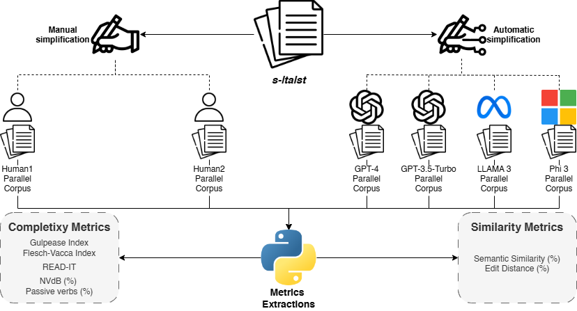

# AI vs. Human: Effectiveness of LLMs in Simplifying Italian Administrative Documents
Marco Russodivito, Vittorio Ganfi, Giuliana Fiorentino, and Rocco Oliveto


## Abstract
This study investigates the effectiveness of Large Language Models (LLMs) in simplifying Italian administrative texts compared to human informants. This research evaluates the performance of several well-known LLMs, including *GPT-3.5-Turbo*, *GPT-4*, *LLaMA 3*, and *Phi 3*, in simplifying a corpus of Italian administrative documents (*s-ItaIst*), a representative corpus of Italian administrative texts. To accurately compare the simplification abilities of humans and LLMs, six parallel corpora of a subsection of ItaIst are collected. These parallel corpora were analyzed using both complexity and similarity metrics to assess the outcomes of LLMs and human participants. Our findings indicate that while LLMs perform comparably to humans in many aspects, there are notable differences in structural and semantic changes. The results of our study underscore the potential and limitations of using AI for administrative text simplification, highlighting areas where LLMs need improvement to achieve human-level proficiency.


## Experimental design



## Setup
Create a virtual environment
```sh
python3 -m venv venv
source venv/bin/activate
```

Install dependencies
```sh
pip install -r requirements.txt
```


## Replication Package Content
* `s_itaist_corpus`: folder that contains the original documents of the s-ItaIst corpus
  * `{document_id}.pdf`: original document
  * `{document_id}.md`: extracted texts
* `simplified_corpora`: folder that contains all the s-ItaIst parallel corpora. Each .csv file contains:
  * `document`: document identifier
  * `paragraph_index`: sequential number in relation to the original document
  * `original_text`: plain text of the original paragraph
  * `simplified_text`: plain text of the simplified paragraph
* `automatic_simplifier.py` and `utils`: the code employed to automatically simplify the s-ItaIst. It requires `OPEN_AI_KEY` and a modern GPU with al least 12GB VRAM.
* `exec_readit.py`: script to launch read-it jobs (must be executed before `metrics_extractor.py`).
* `metrics_extractor.py`: script to extract metrics from each parallel corpus. It employs [italian-ats-evaluator](https://github.com/RedHitMark/italian-ats-evaluator).
* `metrics_overview.ipynb`: jupyter notebook used to summarize the metrics on parallel corpora.
* `metrics_statistical_analysis.ipynb`: jupyter notebook used to perform the statistical analysis described in the paper.


## Acknowledgements
This contribution is a result of the research conducted within the framework of the PRIN 2020 (Progetti di Rilevante Interesse Nazionale) "VerbACxSS: on analytic verbs, complexity, synthetic verbs, and simplification. For accessibility" (Prot. 2020BJKB9M), funded by the Italian Ministero dell'Università e della Ricerca.


## How to cite us
Marco Russodivito, Vittorio Ganfi, Giuliana Fiorentino, and Rocco Oliveto (2024). AI vs. Human: Effectiveness of LLMs in Simplifying Italian Administrative Documents. In *Proceedings of the 10th Italian Conference on Computational Linguistics (CLiC-it 2024)*.

```bibtex
@inproceedings{russodivito2024ai,
  title     = {AI vs. Human: Effectiveness of LLMs in Simplifying Italian Administrative Documents},
  author    = {Russodivito, Marco AND Ganfi, Vittorio AND Fiorentino, Giuliana AND Oliveto, Rocco},
  booktitle = {Proceedings of the Tenth Italian Conference on Computational Linguistics (CLiC-it 2024)}
  year      = {2024},
}
```